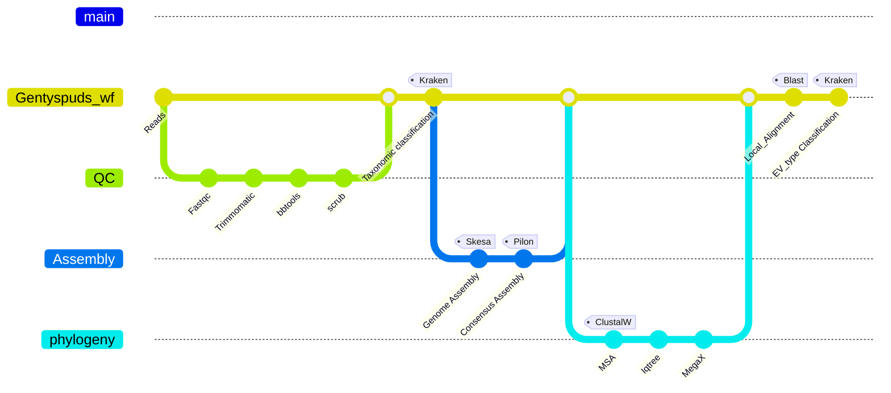

# GentySpuds
A web-deployed pipeline to seek genotyping for Enterovirus.
## An enterovirus is a small and enveloped mRNA virus that can causes infections in people of all ages.

# Introduction
Genotyping is a way of putting a virus into categories based on similar genes.
Determining the genotype of viruses is important not only in epidemiology studies, but also for efficient vaccine development
and treatment.       

# Workflow

   
# Software Tools implemented
FASTQC, trimmomatic, bbtools, sra_human_scrubber, Multiqc, skesa, kraken, bwa, samtools, pilon, quast, Blast, clustalo, iqtree, MegaX etc. 

# Installation
### Clone repository
```
git clone https://github.com/BPHL-Molecular/GentySpuds.git
```
### Create your conda environment
Use the provided gentyspuds_environment.yaml file to execute the command below, and a conda environment called GENTYSPUDS will be created.    
```
conda env create -f gentyspuds_environment.yml
```

# Usage
GentySpuds takes as input raw sequencing reads in FASTQ format, and can process gzipped files directly.  
Make sure all your fastq files are stored in one directory. The databases are stored in the share drive in blue on HPG. <br />
Activate the created conda environment <br />
```
conda activate GENTYSPUDS
```
The basic command to run the pipeline is set below. <br />   
```
nextflow run gentyspuds_wf.nf -params-file params.yaml -resume
```

For efficiency, run the above command within the supplied sbatch script. Check the script first to update email and path. Create this directory <<nextflow_temp>> and edit the path to save the nextflow temporary directory.

```
sbatch gentyspuds_jobScheduler.sh
``` 

## Overview of the arguments
- nextflow is a workflow programming language that allows reproducibility, portability, scalability of large datasets analysis.
- gentyspuds_wf.nf is the main script workflow to run the pipeline.  
- params.yaml indicates all the required input files along with their paths.
The file params.yaml provides a convenient way to feed the workflow with the input data, especially when there are multiple parameters as it is the case.

## Pipeline Outputs
The main output directory contains a sum-report file, which is table with the last columns being the Enterovirus genotyping results for each sample. There is a subdirectory for each sample that stores various files including annotated phylogenetic trees, Blast alignment report, average nucleotide identity etc.